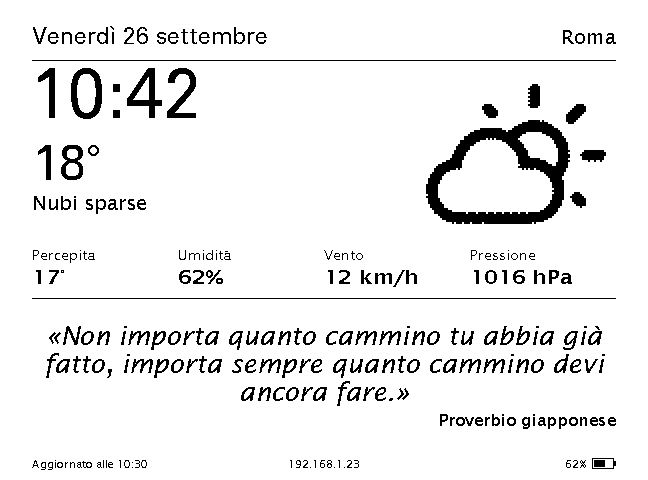
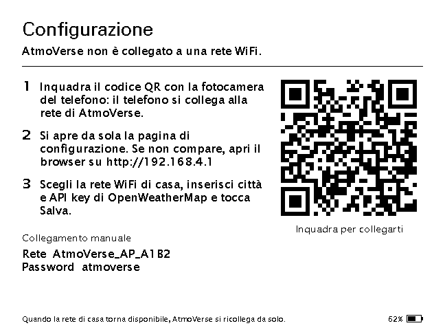
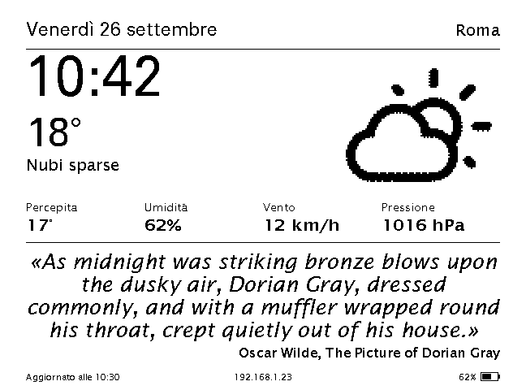
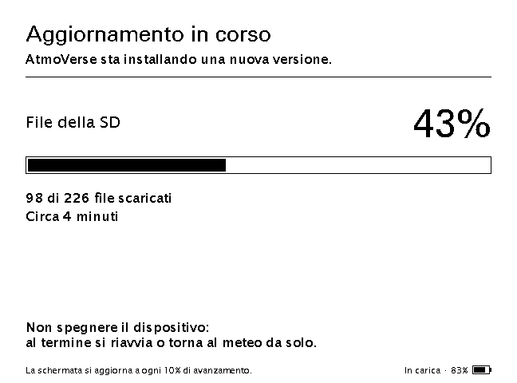
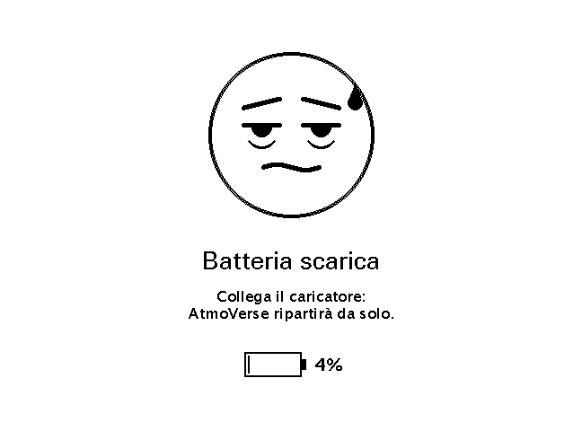
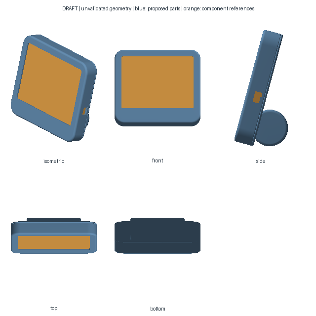
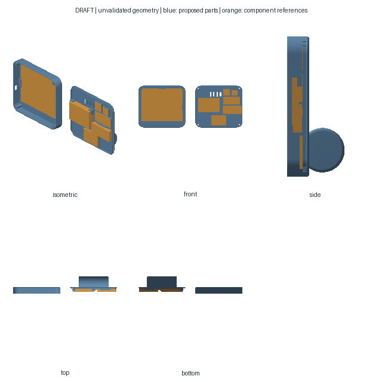
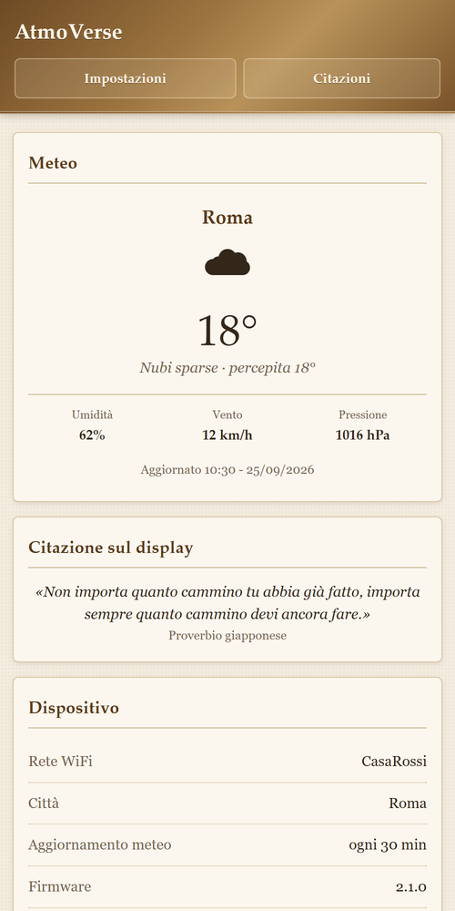
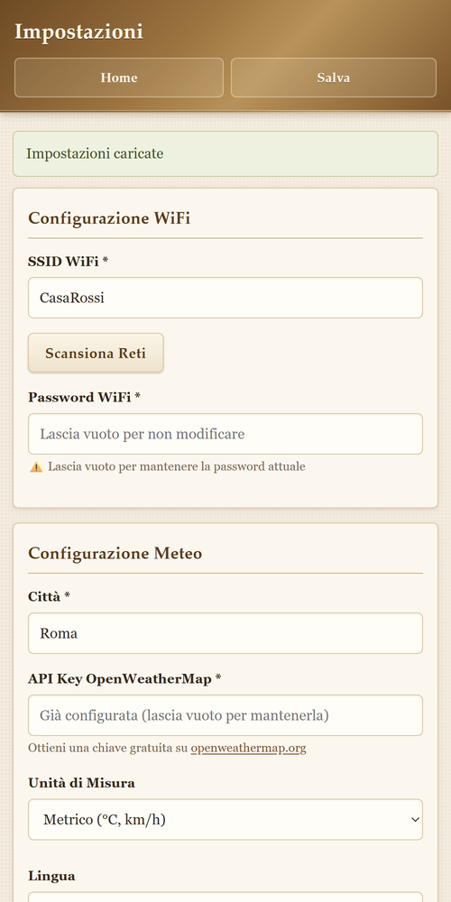
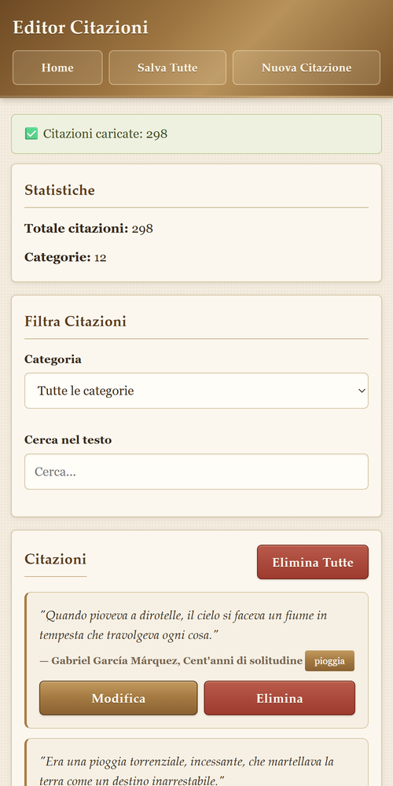

<div align="center">

# AtmoVerse

**An e-ink weather station for your home: time, weather and a literary quote, on electronic paper.**

ESP32 · 5.83″ e-ink display · battery powered · self-updating from GitHub · Italian / English



</div>

---

## What it does

- **Weather at a glance.** Temperature, feels-like, humidity, wind and pressure from OpenWeatherMap, with icons drawn for e-ink.
- **A literary clock.** At many minutes of the day it shows a quote from a book that mentions that exact time. Otherwise it picks a quote that suits the weather and the time of day, or one you scheduled for a given day and hour. The font adapts to the length, so quotes are never cut.
- **Setup from your phone.** On first start the display shows a QR code: scan it, the phone joins AtmoVerse's network and the setup page opens by itself.
- **Updates itself.** Firmware, web pages and icons come from GitHub releases, each file verified with SHA-256, with automatic rollback if a new firmware fails to start.
- **Lasts on battery.** On battery the WiFi is switched on only when needed and the board sleeps between minute refreshes. Touching a case screw wakes the web page for 10 minutes.
- **Two languages.** Display and web pages in Italian or English, chosen in the settings.
- **Keeps working offline.** A DS3231 real-time clock keeps the time without internet; if the home network drops, AtmoVerse reconnects by itself.

<table>
  <tr>
    <td align="center" width="50%">
      <br>
      <sub><b>First setup</b> · scan the QR code and follow three steps</sub>
    </td>
    <td align="center" width="50%">
      <br>
      <sub><b>Adaptive font</b> · long quotes stay whole</sub>
    </td>
  </tr>
  <tr>
    <td align="center" width="50%">
      <br>
      <sub><b>Updates</b> · progress, files and remaining time</sub>
    </td>
    <td align="center" width="50%">
      <br>
      <sub><b>Battery empty</b> · the board sleeps until it is charged</sub>
    </td>
  </tr>
</table>

<sub>Images are rendered from the code with the display's real fonts (<code>tools/anteprima_display.py</code>), with sample data, in Italian.</sub>

---

## Hardware

| Part | Model | Connection |
|---|---|---|
| Board | WEMOS LOLIN32 (ESP32, 4 MB flash) | — |
| Display | 5.83″ e-ink 648×480, GDEW0583T8 (bare panel + driver board) | SPI (VSPI): BUSY 4 · RST 16 · DC 17 · CS 5 · SCK 18 · MOSI 23 |
| SD card | microSD FAT32 module | SPI (HSPI): CS 14 · SCK 27 · MOSI 26 · MISO 25 |
| Clock | DS3231 | I²C (Wire1): SDA 13 · SCL 15 |
| Battery | LiPo pack, 2 × 3500 mAh in parallel (66 × 43 × 13 mm) | measured by INA219 on I²C (Wire): SDA 32 · SCL 33, address 0x41 |
| Touch button | a case screw wired to GPIO2 (touch T2) | ring terminal under the screw |

### Case

A two-part desk case with soft rounded lines and a cylindrical stand that tilts the display by 15°. The front frame holds the panel; the back cover carries the stand and cradles for the battery and modules, and closes with four M3 screws into heat-set inserts.

<table>
  <tr>
    <td align="center" width="50%"><br><sub><b>On the desk</b></sub></td>
    <td align="center" width="50%"><br><sub><b>Inside</b> · frame and back cover</sub></td>
  </tr>
</table>

- Print-ready files: [`cad/stampa/`](cad/stampa) (STL and STEP). Print the frame face down; print the back cover standing on its bottom edge, with supports under the cylinder.
- Parametric source: [`cad/model_build.py`](cad/model_build.py) (build123d).
- Hardware: 4 × M3 screws, 4 × M3 heat-set inserts (Ø 4 mm), one M3 ring terminal for the touch screw.
- The e-paper driver board size is still a placeholder (45 × 30 mm): adjust `DRV_W`, `DRV_H` in the source.

---

## Installation

### 1. First firmware upload (once)

One USB upload is enough: from then on AtmoVerse updates itself.

Requirements: [Arduino CLI](https://arduino.github.io/arduino-cli/) or Arduino IDE with **esp32 core 3.3.8** and these libraries:

| Library | Version |
|---|---|
| GxEPD2 | 1.6.9 |
| Adafruit GFX Library · Adafruit BusIO | 1.12.6 · 1.17.4 |
| U8g2_for_Adafruit_GFX | 1.8.0 |
| ArduinoJson | 7.4.3 |
| RTClib | 2.1.4 |
| Adafruit INA219 | 1.2.3 |

Connect the board and run, from PowerShell in the project folder:

```powershell
.\upload_lolin32_bigapp.ps1 -Port COM4
```

The script uses `partitions.csv`, which splits the flash into two 1.9 MB app slots needed by the automatic updates.

### 2. SD card

Any FAT32 microSD, even empty: web pages and icons are downloaded from GitHub the first time AtmoVerse goes online.

### 3. First setup

1. Switch AtmoVerse on: with no network configured it shows the QR code screen.
2. Scan the QR code with your phone camera. The phone joins `AtmoVerse_AP_xxxx` and the setup page opens (otherwise open `http://192.168.4.1`).
3. Enter your home WiFi, your city and an [OpenWeatherMap API key](https://openweathermap.org/api) (free), then tap **Save**.

AtmoVerse restarts, connects, downloads what is missing and shows the weather. The interface language can be changed later in **Settings → Language**.

---

## Quotes

For every display refresh the quote is chosen in this order:

1. **Scheduled**, if one is active: with a start time and duration, days of the week, or a date (every year or once).
2. **Literary clock**: a quote that mentions the current time, from `/orari/00.txt … 23.txt` on the SD card (optional).
3. **Weather**: a quote that suits the weather and the time of day.

Everything is edited from the web editor (`/quotes-editor.html`), which has two tabs:

- **Weather and scheduled** — the quotes in `quotes.json`.
- **Literary clock** — one hour at a time, with the covered minutes for each hour and a warning on quotes too long for the display (checked by the board with the real fonts).

Example of a scheduled quote in `quotes.json`:

```json
"programmate": [
  { "text": "Good morning! Every morning is a blank page.", "author": "Anonymous",
    "ora": "07:00", "durata": 90, "giorni": "lun,mar,mer,gio,ven" }
]
```

The `/orari` files can also be generated from a CSV `HH:MM|phrase|text|work|author`. They live on the SD card only and are never part of the repository or of the updates:

```bash
python tools/prepara_citazioni_orarie.py quotes.csv E:/
```

---

## Power

| Power source | Behaviour |
|---|---|
| **Charger connected** | Everything always on: WiFi, web page, display refresh every minute. |
| **Battery** | WiFi off except for short windows: weather and time every 30 minutes, update check every 6 hours. Between minute refreshes the ESP32 is in light sleep. |
| **Battery, after a touch** | Touching the screw wakes the board: WiFi and web page stay on for 10 minutes, extended by every request. A WiFi icon next to the city shows when the WiFi is on. |

Plugging or unplugging the charger is detected within 2 seconds. The touch threshold is recalibrated at every change of power source, and false touches are ignored.

Battery levels: a warning in the footer at 15%, and at 5% the display shows an empty-battery screen and the board sleeps, checking every 30 minutes until it is charged. A new firmware is not installed below 25% unless the charger is connected.

---

## Automatic updates

At start-up and every 6 hours AtmoVerse checks the latest release and downloads only what changed.

- **Chain of trust.** The release information comes from `api.github.com` with a verified certificate, including the SHA-256 of `manifest.json`. The manifest is accepted only if its hash matches, and it carries the SHA-256 of the firmware and of every SD file. GitHub serves release files from a CDN whose Let's Encrypt "Root YR" chain the ESP32 certificate bundle cannot verify, so those downloads are encrypted but checked by hash instead.
- **SD files** (`sd_files/`): prepared in `/upd` and applied all together, even after an interruption. The release the SD card matches is remembered, so the periodic check skips re-hashing every file (a manual check from the web page always does the full check).
- **Firmware**: written to the second app slot, 3 attempts. If the new version does not survive its first 60 seconds, the bootloader goes back to the previous one and the faulty version is never downloaded again.
- **Personal files** (settings, `quotes.json`, `layout.json`, `/orari`): never overwritten.
- If the SD card is full, the display explains how much space is needed.

### Publishing a new version

```bash
git tag v2.1.11
git push origin v2.1.11
```

The GitHub Action [`release.yml`](.github/workflows/release.yml) builds the firmware, generates the manifest with [`tools/make_manifest.py`](tools/make_manifest.py) and publishes the release. Devices install it at their next check, or immediately with **Settings → Check for updates**.

---

## Web interface

Reachable at the IP address shown at the bottom of the display (during setup: `http://192.168.4.1`). Designed for smartphones first. The pages are written in Italian and translated to English by [`sd_files/www/i18n.js`](sd_files/www/i18n.js) when English is selected.

<table>
  <tr>
    <td align="center" width="33%"><br><sub><b>Home</b></sub></td>
    <td align="center" width="33%"><br><sub><b>Settings</b></sub></td>
    <td align="center" width="33%"><br><sub><b>Quotes</b></sub></td>
  </tr>
</table>

| API | Description |
|---|---|
| `GET /api/weather` | Current weather |
| `GET/POST /api/settings` | Read or save the settings. The API key is never returned; an empty password or API key keeps the stored one |
| `GET /api/wifi/scan` | Visible WiFi networks |
| `GET/POST /api/quotes` | Read or save the weather and scheduled quotes |
| `GET /api/orari` | Literary clock summary: quotes and covered minutes per hour |
| `GET /api/orari?h=8` · `?h=8&fit=1` | One hour of the literary clock, or which of its quotes fit the display |
| `POST /api/orari?h=8` | Save one hour (plain text, max 64 KB, written via a temporary file) |
| `GET /api/battery` | Voltage, current, percentage, charging |
| `POST /api/update/check` | Check for updates now |

> The web interface has no password: anyone on your home network can change the settings. Use AtmoVerse only on networks you trust.

---

## Architecture

The ESP32's two cores are used like this:

| Core | Runs |
|---|---|
| **Core 1** · main loop | Web server and captive portal, weather, updates, quotes, battery, RTC, SD card, power management |
| **Core 0** · display task | Drawing and refreshing the e-ink panel (about 4.5 s), at low priority next to the WiFi stack |

The loop prepares a snapshot of the screen (data, quote, icon already read from the SD card) and hands it to the display task, then goes straight back to the network: the web page keeps answering during a refresh. The display task never touches the SD card or the network; the only shared data is the pending screen, protected by a mutex. The display and the SD card use separate SPI buses, so they really work in parallel.

The CPU runs at 80 MHz, downloads included: raising it to 240 MHz during downloads made the HTTPS connections fail.

## Project layout

| File | Contents |
|---|---|
| `AtmoVerse_2.0.ino` | Start-up, main loop, network and periodic tasks |
| `DisplayTask.cpp` | Display task on core 0 |
| `Screens.cpp` | Display screens: layout, typography, adaptive quote, WiFi icon |
| `Display.cpp` | Building the screens in the loop (data, quote, icon) |
| `EcoPower.cpp` | Battery power saving, WiFi windows, light sleep, touch button |
| `Language.cpp` | Interface language |
| `Updater.cpp` | Automatic updates from GitHub with rollback |
| `WeatherUtils.cpp` | Weather from OpenWeatherMap (HTTPS) |
| `QuotesManager.cpp` | Quote selection |
| `QRCodeHelper.cpp` | QR codes with the ESP-IDF `esp_qrcode` component |
| `WebServer.cpp` · `WebMinimal.cpp` | Web interface, API and the minimal setup page built into the firmware |
| `NetworkUtils.cpp` | WiFi, access point mode, time zone |
| `BatteryManager.cpp` · `RTCManager.cpp` | Battery (INA219) and clock (DS3231) |
| `sd_files/` | SD card contents distributed with the updates |
| `cad/` | Case source and print files |
| `tools/` | Display previews, manifest, literary clock files |

---

## Credits

- Weather icons: [Weather Icons](https://erikflowers.github.io/weather-icons/) by Erik Flowers ([SIL OFL 1.1](LICENSES/OFL-1.1.txt)), converted to bitmaps for e-ink.
- Fonts: FreeUniversal (SIL OFL 1.1) and Lucida Sans (© Bigelow & Holmes, X11 font license) through [U8g2](https://github.com/olikraus/u8g2).
- Weather data provided by [OpenWeather](https://openweathermap.org).
- Libraries: GxEPD2, Adafruit GFX, Adafruit BusIO, Adafruit INA219, RTClib, ArduinoJson, U8g2_for_Adafruit_GFX, Arduino core for ESP32 / ESP-IDF.
- Case modelled with [build123d](https://github.com/gumyr/build123d) and [Amagine3D](https://github.com/amagine-ai/Amagine3D).
- Design inspired by literary clocks such as [Author Clock](https://www.authorandco.com/).

Full list with versions and licenses: [THIRD_PARTY_NOTICES.md](THIRD_PARTY_NOTICES.md).

## License

The source code of AtmoVerse is released under the [MIT license](LICENSE) © overthemax.

The firmware binaries in the releases include GxEPD2, licensed under the GNU GPL v3, so each binary as a whole is distributed under the GPL v3; its complete source is this repository at the release tag. Third-party libraries, fonts and icons keep their own licenses, listed in [THIRD_PARTY_NOTICES.md](THIRD_PARTY_NOTICES.md).
